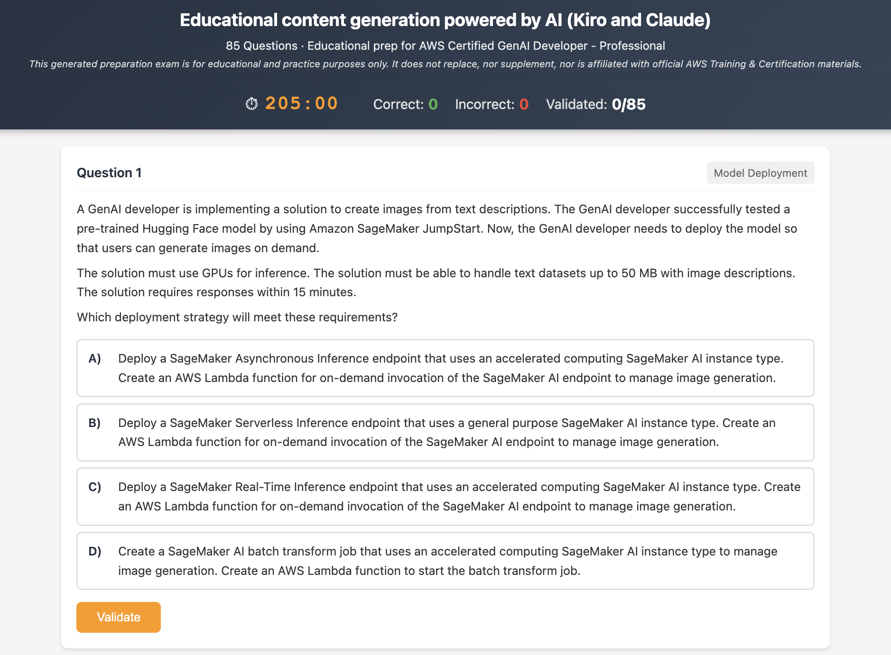

# Educational AI generated content for AWS Certified Generative AI Developer – Professional Prep

> **⚠️ Disclaimer:** This generated exam is for educational and practice purposes only. It does not replace, nor supplement, nor is affiliated with official [AWS Training & Certification](https://aws.amazon.com/training/) materials. It was created as a way to use Generative AI for creating educational content.

An interactive 85-question prep exam for the [AWS Certified Generative AI Developer – Professional](https://aws.amazon.com/certification/certified-generative-ai-developer-professional/) certification, built using [Kiro](https://kiro.dev)'s spec-driven development workflow and Claude models.



## Usage

Open `educational-prep-exam-aws-genai-pro.html` in any modern browser. No build step, no dependencies, no server required. Works offline once loaded.

```bash
git clone https://github.com/michaelgarcia/educational-aws-gen-ai-certification-prep.git
open educational-aws-gen-ai-certification-prep/educational-prep-exam-aws-genai-pro.html
```

The exam presents 85 multiple-choice questions across 5 domains with a 205-minute countdown timer. Select answers and click Validate to check your response with detailed justifications.

## Replicating This Approach

The primary value of this project is the methodology. See [`METHODOLOGY_GUIDE.md`](METHODOLOGY_GUIDE.md) for the step-by-step workflow, and the [`specs/`](specs/) directory for the actual Kiro spec artifacts (requirements, design, tasks) used to build this project. The current methodology was built using barebone Claude and Kiro capabilities with prompting engineering, as a rapid proof of concept.

## Project Structure

```
educational-aws-gen-ai-certification-prep/
├── specs/                                          # Kiro spec-driven development artifacts
│   ├── requirements.md                             # What to build (user stories, acceptance criteria)
│   ├── design.md                                   # How to build it (architecture, data models)
│   ├── tasks.md                                    # Incremental implementation plan
│   └── README.md                                   # Specs overview
├── educational-prep-exam-aws-genai-pro.html        # The interactive prep exam (open in browser)
├── educational-aws-gen-ai-certification-prep-thumbnail.png  # README thumbnail
├── METHODOLOGY_GUIDE.md                            # Step-by-step guide to replicate this approach
└── LICENSE                                         # MIT License
```

## License

This project is licensed under the MIT License. See [LICENSE](LICENSE) for details.
